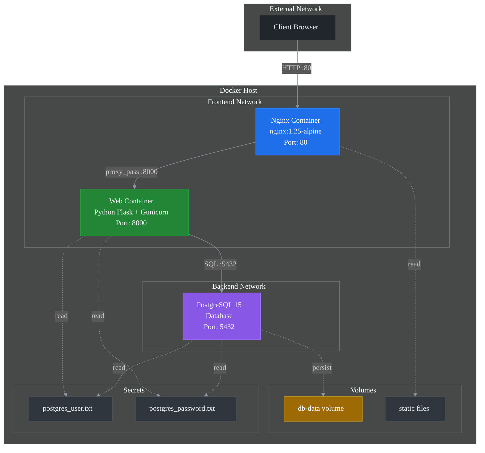

```mermaid
%%{init: {
  "theme": "dark",
  "themeVariables": {
    "background": "#0d1117",
    "primaryColor": "#161b22",
    "primaryTextColor": "#e6edf3",
    "primaryBorderColor": "#30363d",
    "lineColor": "#8b949e",
    "secondaryColor": "#21262d",
    "tertiaryColor": "#161b22",
    "fontFamily": "Inter, system-ui, sans-serif"
  }
}}%%

graph TB
    subgraph External["External Network"]
        Client["Client Browser"]
    end

    subgraph Host["Docker Host"]
        subgraph Front["Frontend Network"]
            Nginx["Nginx Container<br/>nginx:1.25-alpine<br/>Port: 80"]
            Web["Web Container<br/>Python Flask + Gunicorn<br/>Port: 8000"]
        end

        subgraph Back["Backend Network"]
            Web
            DB["PostgreSQL 15<br/>Database<br/>Port: 5432"]
        end

        subgraph Vols["Volumes"]
            DBData["db-data volume"]
            Static["static files"]
        end

        subgraph Sec["Secrets"]
            PGUser["postgres_user.txt"]
            PGPass["postgres_password.txt"]
        end
    end

    Client -->|HTTP :80| Nginx
    Nginx -->|proxy_pass :8000| Web
    Web -->|SQL :5432| DB

    DB -.->|persist| DBData
    Nginx -.->|read| Static
    Web -.->|read| PGUser
    Web -.->|read| PGPass
    DB -.->|read| PGUser
    DB -.->|read| PGPass

    %% Node styling (dark-theme friendly)
    style Client fill:#21262d,stroke:#30363d,color:#e6edf3
    style Nginx fill:#1f6feb,stroke:#388bfd,color:#ffffff
    style Web fill:#238636,stroke:#2ea043,color:#ffffff
    style DB fill:#8957e5,stroke:#a371f7,color:#ffffff
    style DBData fill:#9e6a03,stroke:#d29922,color:#ffffff
    style Static fill:#30363d,stroke:#484f58,color:#e6edf3
    style PGUser fill:#30363d,stroke:#484f58,color:#e6edf3
    style PGPass fill:#30363d,stroke:#484f58,color:#e6edf3
```
