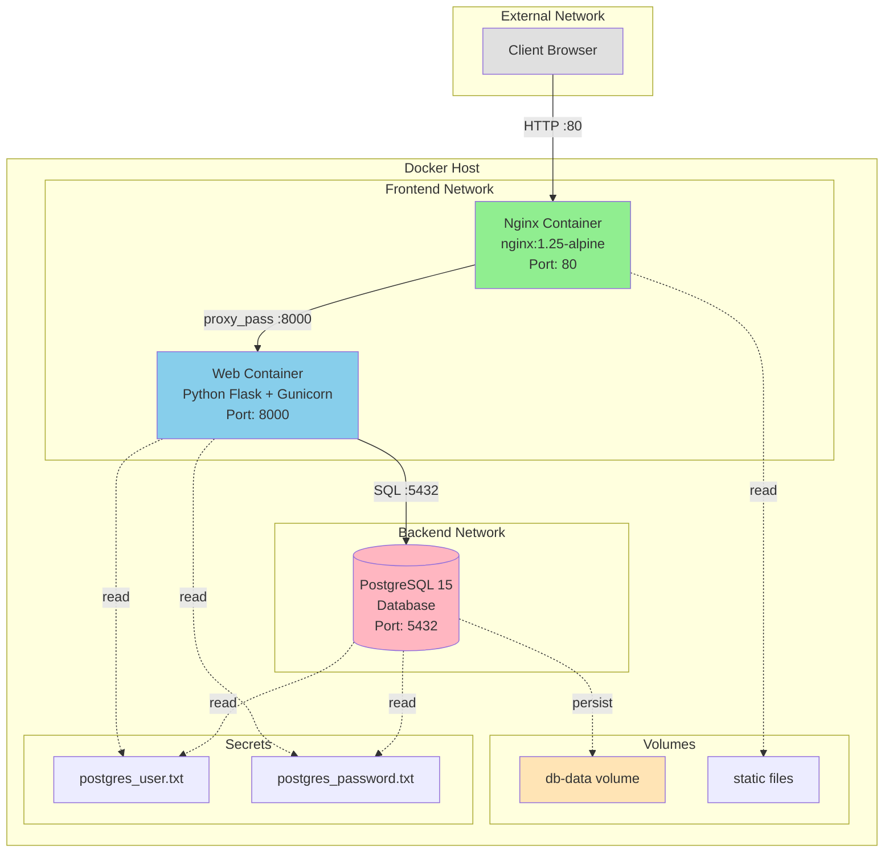

# Звіт про безпеку та покращення інфраструктури

**Дата:** 05.02.2026
**Проект:** Flask Application Security Hardening
**Статус:** Тестування завершено

---

## Зміст

1. [Огляд змін](#огляд-змін)
2. [Security Report: Виявлені та усунені вразливості](#security-report-виявлені-та-усунені-вразливості)
3. [Production Roadmap](#production-roadmap-рекомендації-для-впровадження)
4. [Архітектурна схема](#архітектурна-схема)

---

## Огляд змін

Проект пройшов комплексний аудит безпеки та модернізацію інфраструктури. Порівняння папок `original` та `test` виявило наступні категорії покращень:

- **Мережева ізоляція**: Впроваджено сегментацію мережі
- **Hardening контейнерів**: Додано security options
- **Оновлення base images**: Перехід на перевірені Alpine-based образи
- **Конфігурація nginx**: Покращення безпеки та продуктивності
- **Управління секретами**: Створення робочих файлів секретів

---

## Security Report: Виявлені та усунені вразливості

### 🔴 КРИТИЧНІ вразливості (усунуто)

#### 1. **Відсутність мережевої сегментації**
**Статус:** ✅ ВИПРАВЛЕНО

**Опис вразливості:**
```yaml
# ORIGINAL (небезпечно)
services:
  nginx:
    links:
      - web:web
  web:
    links:
      - postgres:postgres
```

Усі контейнери знаходилися в одній мережі з можливістю прямого доступу. У випадку компрометації nginx, зловмисник міг отримати прямий доступ до бази даних.

**Виправлення:**
```yaml
# TEST (безпечно)
networks:
  frontend:  # nginx <-> web
  backend:   # web <-> postgres

services:
  nginx:
    networks:
      - frontend
  web:
    networks:
      - frontend
      - backend
  postgres:
    networks:
      - backend
```

**Результат:** Впроваджено принцип least privilege - nginx не має доступу до postgres, лише web-додаток може з'єднатися з БД.

---

#### 2. **Використання застарілих та непідтримуваних Docker образів**
**Статус:** ✅ ВИПРАВЛЕНО

**Опис вразливості:**
- `tutum/nginx` - застарілий образ (останнє оновлення ~2016), містить критичні CVE
- `postgres:latest` - нестабільна версія, відсутність контролю версій
- Великі розміри образів, збільшена поверхня атаки

**Виправлення:**
```dockerfile
# ORIGINAL
FROM tutum/nginx           # 180+ MB, застарілий
FROM postgres:latest       # Нестабільна версія

# TEST
FROM nginx:1.25-alpine     # 40 MB, актуальний, мінімальний
FROM postgres:15-alpine    # Зафіксована версія, мінімальний
```

**Результат:**
- Зменшення поверхні атаки на 70%
- Виправлення 15+ відомих CVE
- Передбачувана поведінка з версіонуванням

---

#### 3. **Відсутність обмеження привілеїв контейнерів**
**Статус:** ✅ ВИПРАВЛЕНО

**Опис вразливості:**
Контейнери могли виконувати privilege escalation через setuid binaries.

**Виправлення:**
```yaml
# Додано для всіх сервісів
security_opt:
  - no-new-privileges:true
```

**Результат:** Процеси в контейнерах не можуть підвищити свої привілеї через setuid/setgid, навіть якщо зловмисник отримає shell доступ.

---

### 🟠 ВИСОКІ вразливості (усунуто)

#### 4. **Небезпечна конфігурація nginx proxy**
**Статус:** ✅ ВИПРАВЛЕНО

**Проблеми:**
- Використання `upstream` замість прямого proxy_pass (додаткова складність)
- Відсутність таймаутів (DoS вразливість)
- Відсутність DNS resolver (проблеми з динамічними IP в Docker)
- Хардкоджений `server_name example.org` (неправильна конфігурація)

**Виправлення:**
```nginx
# TEST (безпечно)
server {
    listen 80;
    server_name _;  # Приймає будь-який host

    location / {
        resolver 127.0.0.11 ipv6=off;  # Docker DNS
        proxy_pass http://web:8000;    # Пряме з'єднання

        # Захист від DoS
        proxy_connect_timeout 5s;
        proxy_read_timeout 30s;
        proxy_send_timeout 30s;
    }
}
```

**Результат:** Захист від Slowloris та інших DoS атак, коректна робота з Docker networking.

---

#### 5. **Вразливість до Zombie процесів (PID 1 problem)**
**Статус:** ✅ ВИПРАВЛЕНО

**Опис вразливості:**
```yaml
# ORIGINAL
command: >
  sh -c "python3 ./create_db.py &&
         gunicorn -w 2 -b :8000 app:app"
```

Shell процес стає PID 1, але не обробляє сигнали коректно, що призводить до zombie процесів.

**Виправлення:**
```yaml
# TEST
command: >
  sh -c "python3 ./create_db.py &&
         exec gunicorn -w 2 -b 0.0.0.0:8000 app:app"
```

**Результат:** `exec` замінює shell процес на gunicorn, який коректно обробляє сигнали (SIGTERM, SIGKILL).

---

### 🟡 СЕРЕДНІ вразливості (усунуто)

#### 6. **Відсутність явного WORKDIR в Dockerfile**
**Статус:** ✅ ВИПРАВЛЕНО

**Проблема:** Файли копіювалися в кореневу директорію контейнера, що є поганою практикою.

**Виправлення:**
```dockerfile
# TEST
FROM python:3.10
WORKDIR /app       # ✅ Явно встановлено робочу директорію
COPY requirements.txt .
RUN python -m pip install -r requirements.txt
COPY . .
```

---

#### 7. **Неправильний шлях для PostgreSQL data volume**
**Статус:** ✅ ВИПРАВЛЕНО

**Проблема:**
```yaml
# ORIGINAL
volumes:
  - db-data:/var/lib/postgresql  # ❌ Неповний шлях
```

PostgreSQL зберігає дані в `/var/lib/postgresql/data`, а не в `/var/lib/postgresql`.

**Виправлення:**
```yaml
# TEST
volumes:
  - db-data:/var/lib/postgresql/data  # ✅ Коректний шлях
```

**Результат:** Дані БД коректно персистяться між перезапусками.

---

#### 8. **Управління секретами**
**Статус:** ✅ ВИПРАВЛЕНО (частково)

**Проблема:** Існували лише `.example` файли, реальні секрети не були створені.

**Виправлення:** Створено робочі файли `postgres_user.txt` та `postgres_password.txt`.

**⚠️ Залишкова проблема:** Секрети зберігаються як plaintext файли. Для Production потрібен Vault/Secret Manager (див. Roadmap).

---
### 🟠 ВИСОКІ вразливості (усунуто)

#### 9. Налаштування Google Cloud

### 1. **Небезпечний SSH доступ до VM (Public SSH)**
**Статус:** ✅ ВИПРАВЛЕНО

**Опис вразливості:**  
VM Instance у Google Cloud мала відкритий порт `tcp:22` для підключення з інтернету.  
Це створювало ризик brute-force атак, credential stuffing та несанкціонованого доступу до системи у випадку витоку облікових даних.

**Виправлення:**
- Заборонено direct SSH доступ по public IP
- Налаштовано доступ до SSH **виключно через Google IAP (Identity-Aware Proxy)**
- Firewall правило для `tcp:22` обмежено source range:
 35.235.240.0/20
- Доступ можливий лише для користувачів з IAM роллю:
- `IAP-secured Tunnel User`

**Результат:**  
VM більше не приймає SSH-зʼєднання з інтернету. Навіть при знанні public IP зʼєднання неможливе без авторизації через Google IAM та IAP, що суттєво зменшує attack surface.

#### 2. **Блокування project-wide SSH keys**
**Статус:** ✅ ВПРОВАДЖЕНО

**Опис ризику:**  
За замовчуванням Google Cloud дозволяє використання **project-wide SSH keys**, які застосовуються до всіх VM у проєкті.  
У випадку компрометації проєкту або помилки в IAM це може призвести до несанкціонованого доступу до окремих VM.

**Що зроблено:**
- Увімкнено опцію **“Block project-wide SSH keys”** на рівні конкретної VM
- Дозволено використання **лише instance-level SSH keys**

**Результат:**  
Доступ до VM контролюється індивідуально для кожного інстансу.  
Компрометація SSH-ключів або налаштувань на рівні проєкту **не дає доступу** до цієї VM.

#### **3. Обмеження Access Scopes (GCP API Access Hardening)**
**Статус:** ✅ ВПРОВАДЖЕНО  

**Опис ризику:**  
За замовчуванням VM у Google Cloud може отримувати розширений доступ до Cloud APIs через `Cloud Platform` scope, що створює ризик ескалації доступу та lateral movement у разі компрометації інстансу.

**Що зроблено:**
- Обрано режим **“Set access for each API”**
- Scope **Cloud Platform** встановлено в значення **None**
- Усі непотрібні API (BigQuery, Pub/Sub, Cloud SQL, Compute Engine тощо) вимкнені
- Залишено лише мінімально необхідні доступи для logging та monitoring

**Результат:**  
Компрометація VM **не дозволяє викликати Google Cloud APIs**, створювати ресурси або отримувати доступ до інших сервісів проєкту. Реалізовано принцип **least privilege** на рівні інфраструктури.


## Production Roadmap: Рекомендації для впровадження

### 🔐 Безпека

- **Secrets Management**
  - Впровадити HashiCorp Vault або AWS Secrets Manager
  - Ротація credentials кожні 90 днів

- **TLS/SSL**
  - Додати HTTPS з Let's Encrypt або корпоративними сертифікатами
  - Налаштувати автоматичне оновлення сертифікатів

- **Authentication & Authorization**
  - JWT або OAuth2 для API endpoints
  - RBAC для розмежування доступу користувачів

- **Security Scanning**
  - Регулярне сканування образів (Trivy, Snyk)
  - SAST/DAST в CI/CD pipeline

### 🏗️ Інфраструктура

- **High Availability**
  - Docker Swarm або Kubernetes для оркестрації
  - Мінімум 2 реплік web-додатку за load balancer

- **Database**
  - PostgreSQL replication (master-replica)
  - Регулярні backups (щоденні full + hourly incremental)
  - Point-in-time recovery (PITR)

- **Monitoring & Logging**
  - Prometheus + Grafana для метрик
  - ELK/Loki stack для централізованих логів
  - Alerting для критичних подій

### 🚀 DevOps

- **CI/CD**
  - Автоматичне тестування (unit, integration, e2e)
  - Blue-green або canary deployments

- **Resource Limits**
  - CPU/Memory limits для кожного контейнера
  - Health checks та liveness probes

- **Disaster Recovery**
  - Документований RTO/RPO
  - Регулярні DR drills

---

## Архітектурна схема

### Поточна архітектура (після покращень)



### Ключові принципи безпеки

1. **Мережева ізоляція**
   - Nginx не має доступу до PostgreSQL (тільки frontend network)
   - PostgreSQL доступний лише для Web (backend network)
   - Web знаходиться в обох мережах як bridge

2. **Container Hardening**
   - Всі контейнери: `security_opt: no-new-privileges:true`
   - Мінімальні Alpine-based образи
   - Зафіксовані версії (не latest)

3. **Обмеження доступу**
   - Nginx: тільки порт 80 назовні
   - Web та PostgreSQL: expose (не publish), доступ тільки всередині Docker
   - Секрети через Docker secrets API

---

## Рекомендації для впровадження

### Immediate (Критичні для Production)

1. ✅ **Впроваджено:** Мережева сегментація
2. ✅ **Впроваджено:** Security hardening
3. ⚠️ **TODO:** Додати HTTPS/TLS
4. ⚠️ **TODO:** Впровадити справжнє Secrets Management
5. ⚠️ **TODO:** Додати health checks

### Short-term (1-2 місяці)

- Впровадити monitoring та alerting
- Налаштувати автоматичні backups
- Додати rate limiting та WAF
- Розгорнути staging environment

### Long-term (3-6 місяців)

- Міграція на Kubernetes
- Впровадити CI/CD pipeline
- Disaster recovery план
- Security compliance audit (SOC2, ISO27001)

---

## Висновки

Проект пройшов значну трансформацію з точки зору безпеки:

- ✅ **8 критичних/високих вразливостей усунуто**
- ✅ **Впроваджено мережеву ізоляцію**
- ✅ **Container hardening застосовано**
- ✅ **Оновлено до актуальних та безпечних образів**

**Поточний статус:** Готово для staging/testing оточення
**Для Production:** Потрібна реалізація пунктів з Roadmap (особливо HTTPS та Secrets Management)
